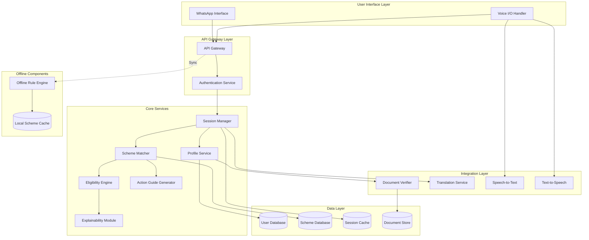
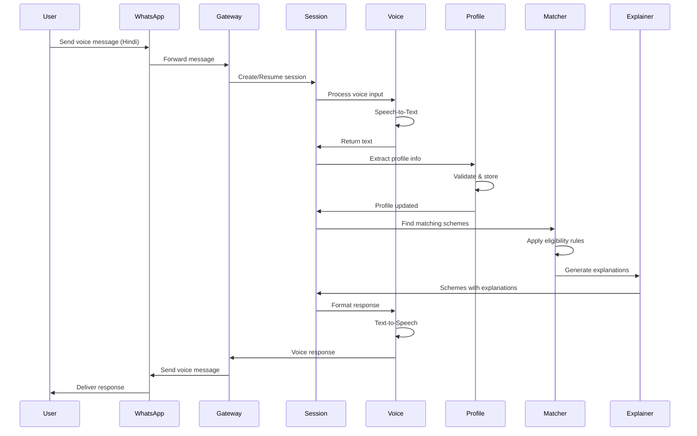

# Design Document: Voice-Based Government Scheme & Opportunity Navigator

## Overview

The Voice-Based Government Scheme & Opportunity Navigator is a multi-layered conversational AI system designed to bridge the digital divide in accessing government services. The architecture prioritizes accessibility, operating in resource-constrained environments while maintaining sophisticated eligibility matching and explainability capabilities.

The system employs a microservices architecture with clear separation between voice processing, business logic, and data persistence. It integrates with WhatsApp as the primary user interface, leverages document verification APIs (conceptually similar to DigiLocker), and implements a hybrid online-offline architecture to ensure availability in low-connectivity scenarios.

Key architectural principles:
- **Accessibility-first**: Voice and text interfaces in multiple languages
- **Resilience**: Graceful degradation and offline capabilities
- **Explainability**: Transparent eligibility decisions with clear reasoning
- **Scalability**: Designed to handle millions of users across diverse geographies
- **Privacy**: End-to-end encryption and minimal data retention

## Architecture

### High-Level Architecture



### Component Interaction Flow



## Components and Interfaces

### 1. WhatsApp Adapter

**Responsibility**: Manages all interactions with WhatsApp Business API, handling message routing, media processing, and session continuity.

**Interface**:
```typescript
interface WhatsAppAdapter {
  // Receive incoming message from user
  receiveMessage(phoneNumber: string, message: Message): Promise<void>
  
  // Send response to user
  sendMessage(phoneNumber: string, content: MessageContent): Promise<void>
  
  // Handle voice message upload/download
  processVoiceMessage(messageId: string): Promise<AudioBuffer>
  
  // Compress and send voice response
  sendVoiceMessage(phoneNumber: string, audio: AudioBuffer): Promise<void>
  
  // Check message delivery status
  getDeliveryStatus(messageId: string): Promise<DeliveryStatus>
}

type Message = TextMessage | VoiceMessage | DocumentMessage
type MessageContent = {
  text?: string
  audio?: AudioBuffer
  document?: DocumentReference
  buttons?: Button[]
}
```

### 2. Voice Interface

**Responsibility**: Handles speech-to-text and text-to-speech conversion with multi-language support and low-bandwidth optimization.

**Interface**:
```typescript
interface VoiceInterface {
  // Convert speech to text
  speechToText(audio: AudioBuffer, language: Language): Promise<TranscriptionResult>
  
  // Convert text to speech
  textToSpeech(text: string, language: Language): Promise<AudioBuffer>
  
  // Detect language from audio
  detectLanguage(audio: AudioBuffer): Promise<Language>
  
  // Compress audio for low bandwidth
  compressAudio(audio: AudioBuffer, quality: CompressionLevel): Promise<AudioBuffer>
}

type TranscriptionResult = {
  text: string
  confidence: number
  alternatives?: string[]
}

type Language = 'hi' | 'ta' | 'te' | 'bn' | 'mr' | 'gu' | 'en'
type CompressionLevel = 'low' | 'medium' | 'high'
```

### 3. Session Manager

**Responsibility**: Maintains conversation state, manages session lifecycle, and coordinates between services.

**Interface**:
```typescript
interface SessionManager {
  // Create new session
  createSession(userId: string, channel: Channel): Promise<Session>
  
  // Retrieve existing session
  getSession(sessionId: string): Promise<Session>
  
  // Update session state
  updateSession(sessionId: string, state: SessionState): Promise<void>
  
  // Process user input and generate response
  processInput(sessionId: string, input: UserInput): Promise<SystemResponse>
  
  // End session and cleanup
  endSession(sessionId: string): Promise<void>
}

type Session = {
  id: string
  userId: string
  language: Language
  state: SessionState
  context: ConversationContext
  createdAt: Date
  lastActivity: Date
}

type SessionState = 'language_selection' | 'profile_collection' | 'document_upload' | 
                    'scheme_browsing' | 'application_guidance' | 'completed'

type ConversationContext = {
  collectedFields: Map<string, any>
  currentStep: string
  pendingQuestions: string[]
  selectedSchemes: string[]
}
```

### 4. Profile Service

**Responsibility**: Collects, validates, and manages user profile information including demographics and documents.

**Interface**:
```typescript
interface ProfileService {
  // Create or update user profile
  upsertProfile(userId: string, profileData: ProfileData): Promise<UserProfile>
  
  // Get user profile
  getProfile(userId: string): Promise<UserProfile>
  
  // Validate profile completeness
  validateProfile(profile: UserProfile): ValidationResult
  
  // Extract profile data from conversation
  extractFromConversation(text: string, context: ConversationContext): Promise<ProfileData>
  
  // Link document to profile
  linkDocument(userId: string, document: Document): Promise<void>
}

type UserProfile = {
  userId: string
  demographics: Demographics
  documents: Document[]
  location: Location
  preferences: UserPreferences
  completeness: number // 0-100
  lastUpdated: Date
}

type Demographics = {
  age?: number
  gender?: 'male' | 'female' | 'other'
  occupation?: string
  incomeLevel?: IncomeLevel
  category?: 'general' | 'obc' | 'sc' | 'st' | 'ews'
  maritalStatus?: string
  dependents?: number
}

type IncomeLevel = 'bpl' | 'apl' | 'low' | 'middle' | 'high'

type Location = {
  state: string
  district: string
  block?: string
  pincode?: string
  coordinates?: {lat: number, lon: number}
}
```

### 5. Document Verifier

**Responsibility**: Validates documents, extracts structured information, and interfaces with external verification services.

**Interface**:
```typescript
interface DocumentVerifier {
  // Verify document authenticity
  verifyDocument(document: Document): Promise<VerificationResult>
  
  // Extract structured data from document
  extractData(document: Document): Promise<ExtractedData>
  
  // Check document against profile
  validateAgainstProfile(document: Document, profile: UserProfile): Promise<ValidationResult>
  
  // Get required documents for scheme
  getRequiredDocuments(schemeId: string): Promise<DocumentRequirement[]>
}

type Document = {
  id: string
  type: DocumentType
  content: Buffer
  format: 'pdf' | 'jpg' | 'png'
  uploadedAt: Date
  verified: boolean
}

type DocumentType = 'aadhaar' | 'pan' | 'income_certificate' | 'caste_certificate' | 
                    'residence_proof' | 'bank_passbook' | 'ration_card'

type VerificationResult = {
  valid: boolean
  confidence: number
  issues: string[]
  verifiedFields: Map<string, any>
}

type ExtractedData = {
  documentType: DocumentType
  fields: Map<string, any>
  confidence: Map<string, number>
}
```

### 6. Scheme Matcher

**Responsibility**: Matches user profiles to eligible government schemes using rule-based and ML-enhanced matching.

**Interface**:
```typescript
interface SchemeMatcher {
  // Find all matching schemes for user
  findMatchingSchemes(profile: UserProfile): Promise<SchemeMatch[]>
  
  // Check eligibility for specific scheme
  checkEligibility(profile: UserProfile, schemeId: string): Promise<EligibilityResult>
  
  // Rank schemes by relevance
  rankSchemes(matches: SchemeMatch[], profile: UserProfile): Promise<SchemeMatch[]>
  
  // Get scheme details
  getScheme(schemeId: string): Promise<GovernmentScheme>
}

type SchemeMatch = {
  scheme: GovernmentScheme
  eligibilityScore: number
  matchedCriteria: string[]
  estimatedBenefit: string
  priority: 'high' | 'medium' | 'low'
}

type GovernmentScheme = {
  id: string
  name: string
  nameTranslations: Map<Language, string>
  description: string
  descriptionTranslations: Map<Language, string>
  department: string
  category: SchemeCategory
  eligibilityCriteria: EligibilityCriteria
  benefits: Benefit[]
  applicationProcess: ApplicationStep[]
  documents: DocumentRequirement[]
  deadlines?: Date[]
  geographicScope: GeographicScope
  active: boolean
}

type SchemeCategory = 'education' | 'health' | 'agriculture' | 'housing' | 
                      'employment' | 'social_welfare' | 'financial_inclusion'

type EligibilityCriteria = {
  rules: Rule[]
  logic: 'AND' | 'OR' | Expression
}

type Rule = {
  field: string
  operator: 'eq' | 'ne' | 'gt' | 'lt' | 'gte' | 'lte' | 'in' | 'contains'
  value: any
  weight: number
}
```

### 7. Eligibility Engine

**Responsibility**: Evaluates complex eligibility rules, handles edge cases, and provides detailed eligibility assessments.

**Interface**:
```typescript
interface EligibilityEngine {
  // Evaluate eligibility rules
  evaluate(profile: UserProfile, criteria: EligibilityCriteria): Promise<EligibilityResult>
  
  // Explain why user is eligible/ineligible
  explainEligibility(result: EligibilityResult): Promise<Explanation>
  
  // Calculate eligibility gap
  calculateGap(profile: UserProfile, criteria: EligibilityCriteria): Promise<EligibilityGap>
  
  // Suggest profile improvements
  suggestImprovements(gap: EligibilityGap): Promise<Suggestion[]>
}

type EligibilityResult = {
  eligible: boolean
  score: number
  matchedRules: Rule[]
  failedRules: Rule[]
  confidence: number
  reasoning: string[]
}

type EligibilityGap = {
  missingFields: string[]
  failedConditions: FailedCondition[]
  requiredChanges: RequiredChange[]
}

type FailedCondition = {
  rule: Rule
  actualValue: any
  requiredValue: any
  gap: number | string
}
```

### 8. Explainability Module

**Responsibility**: Generates human-readable explanations for eligibility decisions in multiple languages.

**Interface**:
```typescript
interface ExplainabilityModule {
  // Generate simple explanation
  generateExplanation(result: EligibilityResult, language: Language): Promise<string>
  
  // Generate detailed explanation
  generateDetailedExplanation(result: EligibilityResult, language: Language): Promise<DetailedExplanation>
  
  // Explain rejection reasons
  explainRejection(failedRules: Rule[], profile: UserProfile, language: Language): Promise<string>
  
  // Generate comparison explanation
  compareSchemes(schemes: GovernmentScheme[], profile: UserProfile, language: Language): Promise<string>
}

type DetailedExplanation = {
  summary: string
  criteriaBreakdown: CriterionExplanation[]
  documentEvidence: DocumentEvidence[]
  nextSteps: string[]
}

type CriterionExplanation = {
  criterion: string
  status: 'met' | 'not_met' | 'partial'
  explanation: string
  evidence: string[]
}
```

### 9. Action Guide Generator

**Responsibility**: Creates step-by-step action plans for scheme applications with location-specific information and progress tracking.

**Interface**:
```typescript
interface ActionGuideGenerator {
  // Generate action checklist for scheme
  generateActionPlan(scheme: GovernmentScheme, profile: UserProfile): Promise<ActionPlan>
  
  // Get nearest office locations
  findNearestOffices(schemeId: string, location: Location): Promise<OfficeLocation[]>
  
  // Track application progress
  updateProgress(userId: string, schemeId: string, completedSteps: string[]): Promise<void>
  
  // Get progress status
  getProgress(userId: string, schemeId: string): Promise<ApplicationProgress>
}

type ActionPlan = {
  schemeId: string
  steps: ActionStep[]
  estimatedTime: string
  difficulty: 'easy' | 'moderate' | 'complex'
  deadlines: Deadline[]
}

type ActionStep = {
  id: string
  order: number
  title: string
  description: string
  type: 'document' | 'online' | 'visit' | 'payment'
  required: boolean
  completed: boolean
  details: StepDetails
}

type StepDetails = {
  documents?: DocumentRequirement[]
  url?: string
  officeLocation?: OfficeLocation
  estimatedCost?: number
  helpText?: string
}

type OfficeLocation = {
  name: string
  address: string
  district: string
  pincode: string
  phone?: string
  hours?: string
  distance?: number
}
```

### 10. Translation Service

**Responsibility**: Provides real-time translation for all user-facing content across supported languages.

**Interface**:
```typescript
interface TranslationService {
  // Translate text to target language
  translate(text: string, targetLanguage: Language): Promise<string>
  
  // Batch translate multiple texts
  batchTranslate(texts: string[], targetLanguage: Language): Promise<string[]>
  
  // Get pre-translated content
  getTranslation(key: string, language: Language, params?: Map<string, string>): Promise<string>
  
  // Detect source language
  detectLanguage(text: string): Promise<Language>
}
```

### 11. Offline Rule Engine

**Responsibility**: Provides basic scheme matching capabilities in offline or low-connectivity scenarios.

**Interface**:
```typescript
interface OfflineRuleEngine {
  // Sync scheme data for offline use
  syncSchemeData(): Promise<void>
  
  // Match schemes offline
  matchSchemesOffline(profile: UserProfile): Promise<SchemeMatch[]>
  
  // Check if offline data is current
  isDataCurrent(): Promise<boolean>
  
  // Get last sync timestamp
  getLastSyncTime(): Promise<Date>
}
```

## Data Models

### User Profile Schema
```typescript
{
  userId: string // Phone number or unique identifier
  demographics: {
    age: number
    gender: 'male' | 'female' | 'other'
    occupation: string
    incomeLevel: 'bpl' | 'apl' | 'low' | 'middle' | 'high'
    category: 'general' | 'obc' | 'sc' | 'st' | 'ews'
    maritalStatus: string
    dependents: number
  }
  location: {
    state: string
    district: string
    block: string
    pincode: string
    coordinates: {lat: number, lon: number}
  }
  documents: [
    {
      id: string
      type: DocumentType
      verified: boolean
      expiryDate?: Date
      extractedData: Map<string, any>
    }
  ]
  preferences: {
    language: Language
    notificationChannel: 'whatsapp' | 'sms'
    privacyConsent: boolean
  }
  createdAt: Date
  lastUpdated: Date
}
```

### Government Scheme Schema
```typescript
{
  id: string
  name: string
  nameTranslations: {
    hi: string
    ta: string
    te: string
    // ... other languages
  }
  description: string
  descriptionTranslations: Map<Language, string>
  department: string
  ministry: string
  category: SchemeCategory
  eligibilityCriteria: {
    rules: [
      {
        field: string // e.g., "age", "incomeLevel", "location.state"
        operator: 'eq' | 'ne' | 'gt' | 'lt' | 'gte' | 'lte' | 'in' | 'contains'
        value: any
        weight: number // For scoring
      }
    ]
    logic: 'AND' | 'OR' | Expression
  }
  benefits: [
    {
      type: 'financial' | 'subsidy' | 'service' | 'training'
      amount?: number
      description: string
      descriptionTranslations: Map<Language, string>
    }
  ]
  applicationProcess: [
    {
      step: number
      title: string
      description: string
      type: 'online' | 'offline' | 'hybrid'
      url?: string
      requiredDocuments: string[]
    }
  ]
  documents: [
    {
      type: DocumentType
      required: boolean
      alternatives?: DocumentType[]
    }
  ]
  geographicScope: {
    level: 'national' | 'state' | 'district'
    applicableStates?: string[]
    applicableDistricts?: string[]
  }
  deadlines: [
    {
      type: 'application' | 'document_submission' | 'verification'
      date: Date
      recurring: boolean
    }
  ]
  active: boolean
  version: number
  lastUpdated: Date
}
```

### Session Schema
```typescript
{
  id: string
  userId: string
  channel: 'whatsapp' | 'web' | 'mobile'
  language: Language
  state: SessionState
  context: {
    collectedFields: Map<string, any>
    currentStep: string
    pendingQuestions: string[]
    selectedSchemes: string[]
    conversationHistory: [
      {
        role: 'user' | 'system'
        content: string
        timestamp: Date
      }
    ]
  }
  metadata: {
    deviceType: string
    networkQuality: 'high' | 'medium' | 'low'
    offlineMode: boolean
  }
  createdAt: Date
  lastActivity: Date
  expiresAt: Date
}
```

## Technology Stack

### Backend Services
- **Runtime**: Node.js 20+ with TypeScript
- **API Framework**: Express.js or Fastify for REST APIs
- **Message Queue**: AWS SQS for asynchronous processing
- **Caching**: Redis for session management and frequently accessed data
- **Database**: 
  - PostgreSQL for structured data (users, schemes)
  - MongoDB for document storage and session data
  - DynamoDB for offline sync data

### AI/ML Services
- **Speech-to-Text**: AWS Transcribe with custom vocabulary for Indian languages
- **Text-to-Speech**: AWS Polly with neural voices for Hindi and regional languages
- **NLP**: AWS Comprehend for entity extraction and sentiment analysis
- **Translation**: AWS Translate with custom terminology for government schemes

### Integration Layer
- **WhatsApp**: WhatsApp Business API via Twilio or official Meta API
- **Document Verification**: Integration with DigiLocker API (conceptual)
- **Authentication**: AWS Cognito for user identity management

### Infrastructure
- **Compute**: AWS Lambda for serverless functions, ECS for containerized services
- **Storage**: S3 for document storage with encryption at rest
- **CDN**: CloudFront for static content and audio file delivery
- **Monitoring**: CloudWatch for logs and metrics, X-Ray for distributed tracing

### Security
- **Encryption**: TLS 1.3 for data in transit, AES-256 for data at rest
- **Secrets Management**: AWS Secrets Manager
- **Access Control**: IAM roles with least privilege principle
- **Compliance**: GDPR and Indian data protection regulations

## Correctness Properties

### Property 1: Language Consistency
**Validates: Requirements 1.1, 1.5, 10.1**

For all sessions and all supported languages:
- If a user selects language L at session start, all system responses in that session must be in language L
- If a user switches from language L1 to L2, all subsequent responses must be in L2
- Scheme names, descriptions, and eligibility criteria must have valid translations in all supported languages

**Test Strategy**: Property-based test that generates random session flows with language switches and verifies response language matches selected language.

### Property 2: Profile Completeness Validation
**Validates: Requirements 2.3, 2.5**

For all user profiles:
- If profile completeness score is 100%, all required fields (age, location.state, location.district) must be non-null
- If any required field is null, completeness score must be < 100%
- Profile summary must accurately reflect all collected fields

**Test Strategy**: Generate random profiles with varying field completeness and verify completeness score calculation.

### Property 3: Document-Profile Consistency
**Validates: Requirements 3.2**

For all documents linked to a profile:
- If document type is 'aadhaar' and extractedData contains age, profile.demographics.age must match within ±1 year tolerance
- If document type is 'income_certificate' and extractedData contains income level, profile.demographics.incomeLevel must be consistent
- System must flag discrepancies and not silently override

**Test Strategy**: Generate profiles and documents with intentional mismatches and verify conflict detection.

### Property 4: Eligibility Determinism
**Validates: Requirements 4.1, 5.1**

For all schemes and user profiles:
- Given the same profile P and scheme S, eligibility evaluation must return the same result
- If profile P1 meets all criteria that profile P2 meets plus additional criteria, and P2 is eligible for scheme S, then P1 must also be eligible for S
- Eligibility score must be monotonic with respect to criteria satisfaction

**Test Strategy**: Generate pairs of profiles where one is strictly better than the other and verify eligibility ordering.

### Property 5: Explanation Completeness
**Validates: Requirements 5.1, 5.2, 5.5**

For all eligibility results:
- If user is eligible, explanation must reference at least one matched criterion
- If user is ineligible, explanation must reference all failed criteria
- Explanation must reference document evidence when eligibility depends on documents
- Explanation text must be non-empty and in the requested language

**Test Strategy**: Generate eligibility results and verify explanation contains required elements.

### Property 6: Action Plan Validity
**Validates: Requirements 6.1, 6.2, 6.4**

For all generated action plans:
- All required steps must be marked as required=true
- Steps must be ordered sequentially (step N comes before step N+1)
- If a step requires documents, those documents must be in the scheme's required documents list
- If a step has an online URL, the URL must be valid and reachable

**Test Strategy**: Generate action plans for various schemes and validate structural properties.

### Property 7: Session State Transitions
**Validates: Requirements 7.5, 13.4**

For all sessions:
- Session state must follow valid transition graph (e.g., language_selection → profile_collection → scheme_browsing)
- If session is interrupted and resumed, state must be preserved
- Session must not transition to 'completed' unless all required steps are finished
- Expired sessions must not be resumable

**Test Strategy**: Generate random session state transitions and verify only valid transitions are allowed.

### Property 8: Low-Bandwidth Optimization
**Validates: Requirements 8.1, 8.2, 8.4**

For all voice messages:
- Compressed audio size must be ≤ 50% of original size
- Audio quality must remain intelligible (measured by transcription accuracy)
- Text responses must be prioritized over audio when bandwidth is low
- Session state must be cached and recoverable after connection drop

**Test Strategy**: Simulate low-bandwidth conditions and verify graceful degradation.

### Property 9: Offline-Online Consistency
**Validates: Requirements 9.1, 9.3**

For all offline operations:
- Schemes matched offline must be a subset of schemes matched online for the same profile
- When syncing after offline operation, online results must supersede offline results
- Offline mode must clearly indicate preliminary status
- No offline result should contradict online result for the same input

**Test Strategy**: Run matching in offline mode, then online mode, and verify consistency.

### Property 10: Privacy and Data Retention
**Validates: Requirements 11.1, 11.3**

For all user data:
- All personal data must be encrypted at rest and in transit
- If user requests deletion, all personal data must be removed within specified timeframe
- Document access must be logged with timestamp and accessor identity
- No personal data should be present in system logs or error messages

**Test Strategy**: Verify encryption, test deletion workflows, audit logs for PII leakage.

### Property 11: Scheme Database Integrity
**Validates: Requirements 12.1, 12.2, 12.4**

For all scheme operations:
- New schemes must have all required fields (name, eligibility criteria, benefits)
- Eligibility rules must be logically consistent (no contradictions)
- When scheme is updated, version number must increment
- Inactive schemes must not appear in matching results

**Test Strategy**: Generate scheme data with missing fields and invalid rules, verify validation.

### Property 12: Error Recovery
**Validates: Requirements 13.1, 13.2, 13.4**

For all error conditions:
- If voice recognition fails 3 times, system must offer text input alternative
- If eligibility cannot be determined, system must explain missing data
- System must never crash; all errors must be caught and handled gracefully
- Error messages must be user-friendly and in user's selected language

**Test Strategy**: Inject failures at various points and verify graceful handling.

### Property 13: Performance Bounds
**Validates: Requirements 14.1, 14.2, 14.3**

For all operations:
- Voice transcription must start within 2 seconds of receiving audio
- Scheme matching must complete within 5 seconds for profiles with ≤ 20 fields
- System must handle 10,000 concurrent sessions without degradation
- Response time must not increase linearly with number of schemes in database

**Test Strategy**: Load testing with varying concurrency and data sizes.

### Property 14: Ranking Consistency
**Validates: Requirements 4.2**

For all scheme rankings:
- If scheme S1 has higher eligibility score than S2 for profile P, S1 must rank higher than S2
- Ranking must be stable (same input produces same ranking)
- If two schemes have equal scores, ranking must use consistent tiebreaker (e.g., scheme ID)

**Test Strategy**: Generate profiles and verify ranking order matches score order.

### Property 15: Multi-Language Translation Accuracy
**Validates: Requirements 10.2, 10.3**

For all translations:
- Eligibility criteria must maintain semantic equivalence across languages
- Numeric values and dates must not be altered during translation
- Technical terms without direct translation must be explained in target language
- Translation must preserve formatting and structure

**Test Strategy**: Translate content to target language and back to source, verify semantic preservation.

## Testing Framework

**Primary Framework**: Jest with TypeScript for unit and integration tests

**Property-Based Testing**: fast-check library for generating test cases

**Test Structure**:
```typescript
// Example property test
import fc from 'fast-check';

describe('Property 4: Eligibility Determinism', () => {
  it('should return same eligibility for same profile and scheme', () => {
    fc.assert(
      fc.property(
        profileArbitrary,
        schemeArbitrary,
        async (profile, scheme) => {
          const result1 = await eligibilityEngine.evaluate(profile, scheme.eligibilityCriteria);
          const result2 = await eligibilityEngine.evaluate(profile, scheme.eligibilityCriteria);
          
          expect(result1.eligible).toBe(result2.eligible);
          expect(result1.score).toBe(result2.score);
        }
      )
    );
  });
});
```

## Implementation Phases

### Phase 1: Core Infrastructure (Weeks 1-3)
- Set up AWS infrastructure (Lambda, API Gateway, databases)
- Implement Session Manager and basic state management
- Create Profile Service with CRUD operations
- Set up WhatsApp Business API integration
- Implement basic authentication and security

### Phase 2: Voice and Language (Weeks 4-6)
- Integrate AWS Transcribe for speech-to-text
- Integrate AWS Polly for text-to-speech
- Implement Translation Service
- Add language detection and switching
- Optimize for low-bandwidth scenarios

### Phase 3: Eligibility Engine (Weeks 7-9)
- Build rule-based Eligibility Engine
- Implement Scheme Matcher with ranking
- Create Explainability Module
- Develop Document Verifier (mock external APIs initially)
- Build scheme database and admin interface

### Phase 4: User Experience (Weeks 10-12)
- Implement conversational profile collection
- Build Action Guide Generator
- Add location-based office finder
- Create progress tracking
- Implement error handling and fallbacks

### Phase 5: Offline and Optimization (Weeks 13-14)
- Build Offline Rule Engine
- Implement data sync mechanisms
- Optimize performance and caching
- Add monitoring and analytics
- Conduct load testing

### Phase 6: Testing and Launch (Weeks 15-16)
- Write comprehensive property-based tests
- Conduct user acceptance testing
- Security audit and penetration testing
- Deploy to production
- Monitor and iterate based on feedback

## Deployment Architecture

### AWS Services Configuration

**Compute**:
- Lambda functions for stateless operations (voice processing, eligibility checks)
- ECS Fargate for stateful services (session management, WebSocket connections)
- Auto-scaling based on CloudWatch metrics

**Data Storage**:
- RDS PostgreSQL (Multi-AZ) for user profiles and schemes
- DocumentDB for session data and conversation history
- S3 with lifecycle policies for document storage
- ElastiCache Redis for session caching

**Networking**:
- VPC with public and private subnets
- Application Load Balancer for HTTP traffic
- NAT Gateway for outbound connections from private subnets
- VPC endpoints for AWS services

**Security**:
- WAF rules for API protection
- KMS for encryption key management
- Secrets Manager for API keys and credentials
- CloudTrail for audit logging

**Monitoring**:
- CloudWatch dashboards for key metrics
- X-Ray for distributed tracing
- SNS for alerting
- CloudWatch Logs Insights for log analysis

## Security Considerations

### Data Protection
- All PII encrypted with AES-256
- TLS 1.3 for all external communications
- Document storage with server-side encryption
- Regular key rotation (90 days)

### Access Control
- IAM roles with least privilege
- MFA for administrative access
- API rate limiting per user
- IP whitelisting for admin interfaces

### Compliance
- GDPR-compliant data handling
- Indian IT Act compliance
- Regular security audits
- Incident response plan

### Privacy
- User consent for data collection
- Right to data deletion
- Data minimization principle
- Anonymized analytics

## Monitoring and Observability

### Key Metrics
- Voice transcription accuracy rate
- Scheme matching latency (p50, p95, p99)
- Session completion rate
- Error rate by component
- User satisfaction score

### Alerts
- API error rate > 5%
- Response time > 10 seconds
- Database connection pool exhaustion
- Failed document verifications > 10%
- Offline sync failures

### Dashboards
- Real-time user activity
- Scheme popularity and conversion
- Geographic distribution of users
- Language preference breakdown
- System health overview

## Future Enhancements

### Phase 2 Features
- AI-powered chatbot for complex queries
- Integration with actual DigiLocker API
- Mobile app for iOS and Android
- Video tutorials in regional languages
- Community forum for user support

### Advanced Capabilities
- Predictive scheme recommendations based on life events
- Integration with e-KYC for instant verification
- Blockchain-based document verification
- Voice biometrics for authentication
- AR-guided application process

### Scale Improvements
- Multi-region deployment for lower latency
- Edge computing for offline capabilities
- GraphQL API for flexible data fetching
- Microservices decomposition for independent scaling